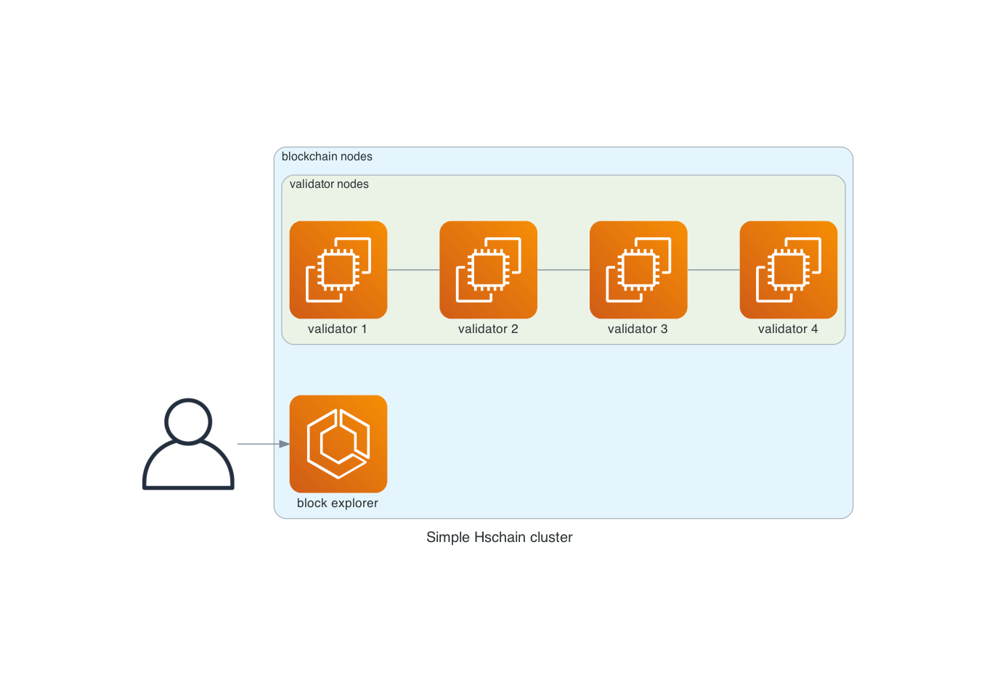

# hschain demo

Это простая демонстрация работы UTXO-based криптовалюты (без смарт-контрактов). Поддерживается только пересылка между кошельками, подтверждаемая подписью.

В демонстрации участвуют 5 узлов: 4 валидатора и 1 блокчейн эксплорер.



## Что делает демонстрация?
Создаётся генезис, в котором задаются начальные балансы для кошельков. После чего постоянно генерируются и помещаются в мемпул случайные транзакции, пересылающие деньги с одного кошелька на другой.

Требования для запуска:
- docker (локальный)
- docker-compose

Обратите внимание на пареметры в файле `config-val.yml`
- airdrop - количество монет в каждом кошельке
- wallets - общее количество кошельков
- generator_delay - частота генерации транзакций (в миллисекундах)
- max_mempool_size - количество транзакций в мемпуле (если больше, чем заданное значение, то генератор останавливается)

Запуск (для остановки нажмите ctrl+C)
```sh
docker-compose up
```

Откройте [http://localhost:8080/bex/](http://localhost:8080/bex/)

Запустить в фоне:
```sh
docker-compose up -d
```
Остановить:
```sh
docker-compose stop
```

Проверить состояние:
```sh
docker-compose ps
```

Остановить и удалить все данные:
```sh
docker-compose down -v
```
